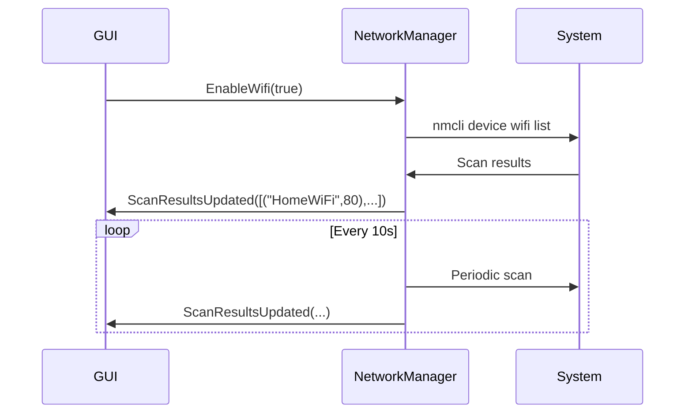
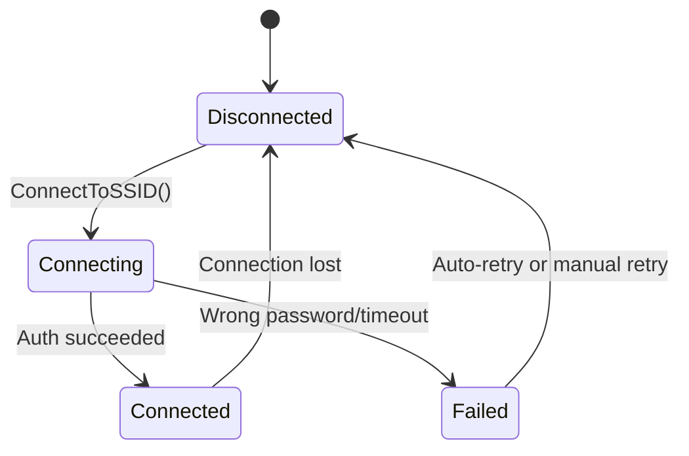
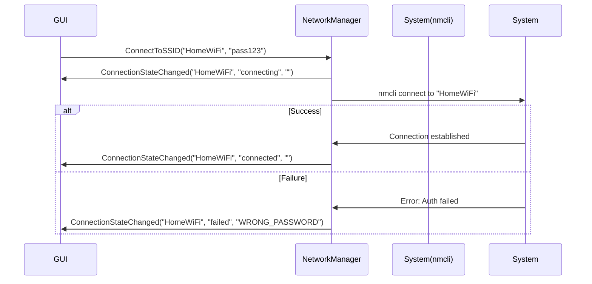

### **Network Manager Architecture with D-Bus**

#### **1. System Design Overview**
For a **GUI process** to control a **standalone NetworkManager process**, we'll use **D-Bus** for IPC with this architecture:

```
[GUI Process] ↔ [D-Bus] ↔ [NetworkManager Daemon] ↔ [nmcli/systemd-networkd]
```

#### **2. Key Components**
| Component | Responsibility |
|-----------|----------------|
| **NetworkManager Daemon** | Runs as a background service (DBus-activated) |
| **DBus Interface** | Exposes: <br> - Methods (Scan, Connect) <br> - Signals (ScanResults, ConnectionStatus) <br> - Properties (CurrentSSID, SignalStrength) |
| **GUI Process** | Calls methods & subscribes to signals |

---

### **Handling Periodic WiFi Scans**
#### **1. Scan Trigger Approaches**
| Method | Pros | Cons |
|--------|------|------|
| **Timer-Based** | Simple to implement | Wastes energy if no GUI is listening |
| **GUI-Requested** | Energy-efficient | Requires explicit user action |
| **Hybrid** | Best of both worlds | More complex |

#### **Recommended: Hybrid Approach**
```plaintext
When GUI is open:
  - Scan every 10 seconds
When GUI is closed:
  - Scan only on explicit request
```

#### **2. Implementation Idea**
```cpp
// NetworkManager Daemon
class NetworkManager : public QObject {
    Q_OBJECT
public:
    void startPeriodicScan() { m_scanTimer.start(10000); }
    void stopPeriodicScan() { m_scanTimer.stop(); }

private slots:
    void onScanTimer() {
        auto results = scanWiFi();
        emit ScanCompleted(results);  // DBus signal
    }

signals:
    void ScanCompleted(const QList<NetworkInfo> &results);
};
```

---

### **Updating Interested Processes**
#### **1. Selective Notification Strategies**
| Method | Use Case |
|--------|----------|
| **DBus Signals** | Push updates to all subscribed GUI instances |
| **DBus Properties** | Let GUIs poll `LastScanResults` when needed |
| **DBus ObjectManager** | Advanced: Dynamic interface management |

#### **Recommended: Signals + Properties**
```plaintext
- Emit `ScanResultsChanged(QList<NetworkInfo>)` signal on new scans
- GUIs subscribe via:
  ```cpp
  QDBusConnection::systemBus().connect(
      "com.example.NetworkManager",
      "/Manager",
      "com.example.NetworkManager",
      "ScanResultsChanged",
      this,
      SLOT(onNewNetworks(QList<NetworkInfo>))
  );
  ```

- Optional: Provide `GetLastScanResults()` method for late-joining GUIs
---

### **DBus Interface Design**
#### **1. Interface Snippet (`network_manager.xml`)**
```xml
<interface name="com.example.NetworkManager">
  <!-- Methods -->
  <method name="ScanNetworks">
    <arg name="force_rescan" type="b" direction="in"/>
  </method>
  
  <!-- Signal -->
  <signal name="ScanResultsUpdated">
    <arg name="networks" type="a(si)" />  <!-- Array of (SSID, strength) -->
  </signal>

  <!-- Property -->
  <property name="Scanning" type="b" access="read">
    <annotation name="org.freedesktop.DBus.Property.EmitsChangedSignal" value="true"/>
  </property>
</interface>
```

#### **2. GUI Interaction Flow**


---

### **Advanced Considerations**
1. **Security**:
   - Restrict DBus access via policy files
   - Validate caller permissions for sensitive operations

2. **Performance**:
   - Debounce scan requests from multiple GUIs
   - Cache results for inactive clients

3. **Error Handling**:
   - Emit `ScanFailed(reason)` signal
   - Provide `LastError` property

---

### **Key Takeaways**
1. **DBus enables clean separation** between GUI and manager
2. **Signals are optimal** for real-time updates
3. **Hybrid scanning** balances responsiveness and power efficiency

---

Here's how to implement a realistic SSID connection flow with proper status updates, followed by a Mermaid diagram:

### **Connection State Handling Design**

#### **1. DBus Interface Additions**
```xml
<interface name="com.example.NetworkManager">
  <!-- Connection Method -->
  <method name="ConnectToSSID">
    <arg name="ssid" type="s" direction="in"/>
    <arg name="password" type="s" direction="in"/>
  </method>

  <!-- Connection Signals -->
  <signal name="ConnectionStateChanged">
    <arg name="ssid" type="s"/>
    <arg name="state" type="s"/> <!-- "connecting", "connected", "failed" -->
    <arg name="error" type="s"/> <!-- Empty unless state=failed -->
  </signal>
</interface>
```

#### **2. State Machine Logic**


#### **3. Sequence Diagram (Mermaid)**


### **Implementation Notes**

1. **NetworkManager Side**:
```cpp
void NetworkManager::connectToSSID(QString ssid, QString password) {
    emit ConnectionStateChanged(ssid, "connecting", "");
    
    QProcess proc;
    proc.start("nmcli", {"device", "wifi", "connect", ssid, "password", password});
    proc.waitForFinished();

    if (proc.exitCode() == 0) {
        emit ConnectionStateChanged(ssid, "connected", "");
    } else {
        QString error = parseNmcliError(proc.readAllStandardError());
        emit ConnectionStateChanged(ssid, "failed", error);
    }
}
```

2. **GUI Side**:
```cpp
// Connect to signals
QDBusConnection::systemBus().connect(
    "com.example.NetworkManager",
    "/Manager",
    "com.example.NetworkManager",
    "ConnectionStateChanged",
    this,
    SLOT(onConnectionState(QString,QString,QString))
);

// Handle updates
void GUI::onConnectionState(QString ssid, QString state, QString error) {
    if (state == "connecting") {
        ui->statusLabel->setText(tr("Connecting to %1...").arg(ssid));
    } 
    else if (state == "connected") {
        showToast(tr("Connected to %1").arg(ssid));
    }
    else if (state == "failed") {
        showError(tr("Failed: %1").arg(error));
    }
}
```

### **Error Handling Cases**
| Error | Example Message | Recovery Suggestion |
|-------|-----------------|---------------------|
| `WRONG_PASSWORD` | "Incorrect password" | Show password re-entry dialog |
| `NO_SSID_FOUND` | "Network unavailable" | Trigger rescan |
| `AUTH_TIMEOUT` | "Router didn't respond" | Check router status |

### **Real-World Considerations**
1. **Async Operations**: Use `QDBusPendingCall` for non-blocking connects
2. **Timeouts**: Add 30-second timeout for connection attempts
3. **Retry Logic**: Allow 1-2 automatic retries before final failure
4. **Cancellation**: Implement `CancelConnection()` method

Would you like me to elaborate on any specific part of the flow?