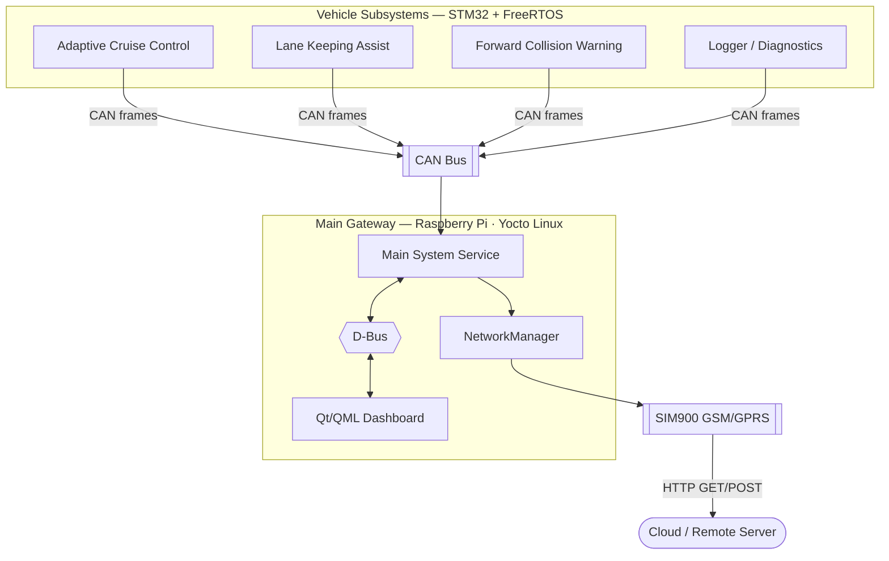

# Logi Drive AI Vision Pro
Engineering notes for a Raspberry Pi + STM32 **Advanced Driver Assistance System** —
a central Linux gateway that coordinates safety subsystems over CAN, exposes them
over D-Bus, and stays connected through a cellular uplink.

  Yocto Linux
  Raspberry Pi
  STM32 · FreeRTOS
  CAN Bus
  D-Bus
  Qt / QML
  SIM900 GSM
  GoogleTest

## About this project

The **Main System** runs on a Raspberry Pi under a custom **Yocto** Linux image and
acts as the central gateway of the car: it turns ADAS subsystems on or off, arbitrates
conflicting requests, drives the driver-facing **Qt/QML dashboard**, and keeps a
**Logger/Diagnostics** channel open for fault reporting. STM32 + FreeRTOS boards handle
the real-time subsystems — Adaptive Cruise Control, Lane Keeping Assist, Forward
Collision Warning — and talk to the gateway over a **CAN bus**. Locally, the gateway's
own services (dashboard, network manager, logger) talk to each other over **D-Bus**;
externally, a **SIM900 GSM/GPRS** module keeps the car reachable for remote
diagnostics and OTA-style data upload.

This site collects the design notes, hardware bring-up guides, and step-by-step
tutorials produced while building that stack.

## Explore the docs

-   :material-sitemap:{ .lg .middle } **System Architecture**

    ---

    How the main gateway coordinates subsystems, resolves conflicts, and logs
    diagnostics.

    [:octicons-arrow-right-24: Read more](architecture/main-system.md)

-   :material-server:{ .lg .middle } **Server & Backend**

    ---

    Backend build notes and the Qt cross-compilation issues hit along the way.

    [:octicons-arrow-right-24: Read more](server/overview.md)

-   :material-cog-sync-outline:{ .lg .middle } **System Services**

    ---

    Packaging gateway components as `systemd` services on the target image.

    [:octicons-arrow-right-24: Read more](systemd/getting-started.md)

-   :material-swap-horizontal:{ .lg .middle } **CAN Bus**

    ---

    Virtual CAN for development, real SocketCAN on the Pi, and the Qt
    `QCanBusDevice` integration.

    [:octicons-arrow-right-24: Read more](can-bus/can-overview.md)

-   :material-linux:{ .lg .middle } **Yocto Linux**

    ---

    Building the custom embedded image: SSH access, Qt6, and image
    customization.

    [:octicons-arrow-right-24: Read more](yocto/introduction.md)

-   :material-chip:{ .lg .middle } **FreeRTOS Porting**

    ---

    Porting FreeRTOS to the STM32F103 subsystem boards.

    [:octicons-arrow-right-24: Read more](freertos/porting-freertos.md)

-   :material-test-tube:{ .lg .middle } **Unit Testing**

    ---

    Getting GoogleTest running for the C++ components.

    [:octicons-arrow-right-24: Read more](unit-testing/googletest-primer.md)

-   :material-lan-connect:{ .lg .middle } **D-Bus IPC**

    ---

    Local inter-process communication: signals, properties, custom and enum
    types, introspection, and policy.

    [:octicons-arrow-right-24: Read more](dbus/01-intro.md)

-   :material-wifi:{ .lg .middle } **Network Management**

    ---

    Wi-Fi via `wpa_supplicant`/`nmcli`, static IP setup, and the SIM900
    cellular fallback.

    [:octicons-arrow-right-24: Read more](network/wpa-supplicant.md)

-   :material-sim:{ .lg .middle } **SIM / GSM Module**

    ---

    Wiring up the SIM900, a virtual serial port for development, and HTTP
    GET/POST over GPRS.

    [:octicons-arrow-right-24: Read more](sim-module/introduction.md)

-   :material-car-cog:{ .lg .middle } **Car Hardware**

    ---

    Encoder readout and IR sensing delivered over the CAN bus.

    [:octicons-arrow-right-24: Read more](car-hardware/encoder.md)

-   :material-monitor-dashboard:{ .lg .middle } **GUI (Qt/QML)**

    ---

    Notes on the driver-facing dashboard: QML bindings and the on-screen
    keyboard.

    [:octicons-arrow-right-24: Read more](gui/qml-binding-vs-assigning.md)

