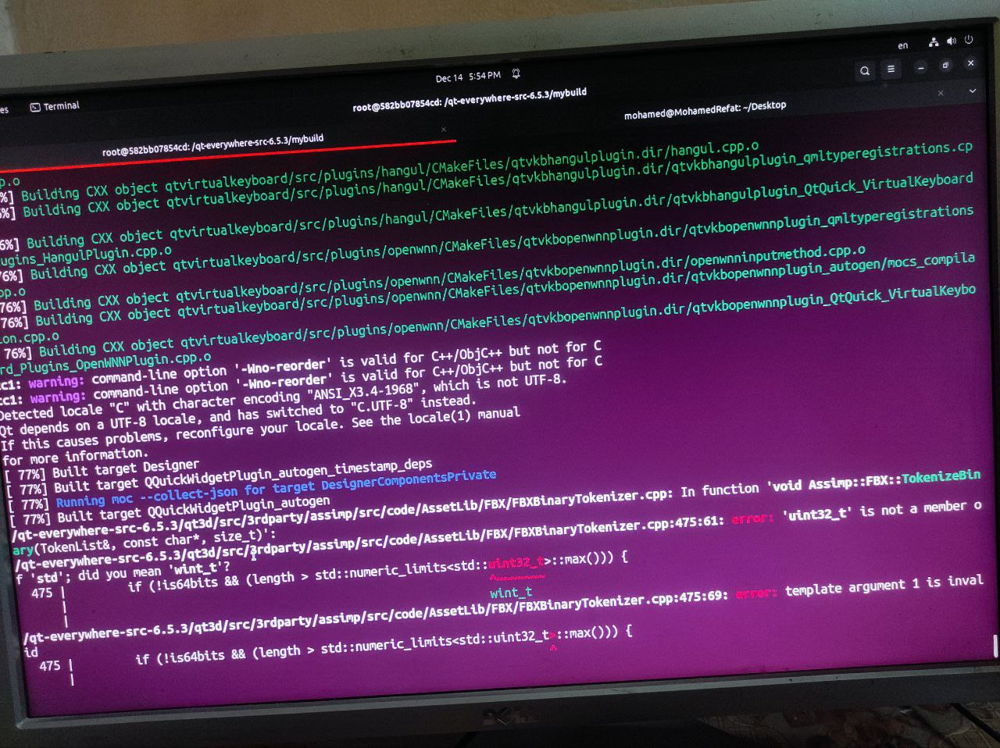

# Steps I have Followed:


i have downloaded Qt-6.5 form here:
```
https://download.qt.io/official_releases/qt/6.5/6.5.0/single/
```

and followed steps form:
```
https://doc.qt.io/qt-6/linux-building.html
```


# Error 

1- Warning messages

```
Detected locale "C" with character encoding "ANSI_X3.4-1968", which is not UTF-8. Qt depends on a UTF-8 locale, but has failed to switch to one. If this causes problems, reconfigure your locale. See the locale(1) manual for more information.
```

2- Error build message



after searching i have reached to  this links which have the same problem but i got nothing!

```
https://forums.gentoo.org/viewtopic-t-1170941.html?sid=8341c6abd1e3bc96d87459a9a713691c
```


# Get a docker image ready for qt app  from here
```
https://hub.docker.com/r/vookimedlo/ubuntu-qt/tags/
```


check this for the needed lib for Qt-App
```
https://gist.github.com/goodarzi/b41cc3d9879429f731d7620b5f2fa8a2
```

